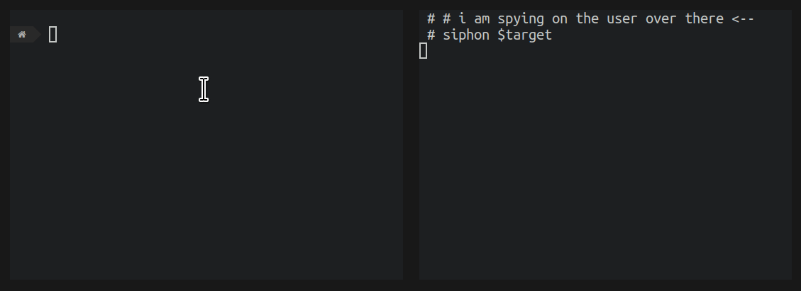

# Siphon

Intercept input/output (_stdin/stdout/stderr_) for any process, even where said output is sent to _/dev/null_ or elsewhere.

It can also be used to spy on another users shell:

Currently Siphon works on Linux, with `amd64`, `arm64`, `arm`, and `386`. Adding support for more architectures is pretty simple, feel free to raise an issue.

It uses `ptrace` which means you'll likely need to run it as `root` for the ptrace privilege.

## Installation

Grab a binary from the [latest release](https://github.com/liamg/siphon/releases/latest).
